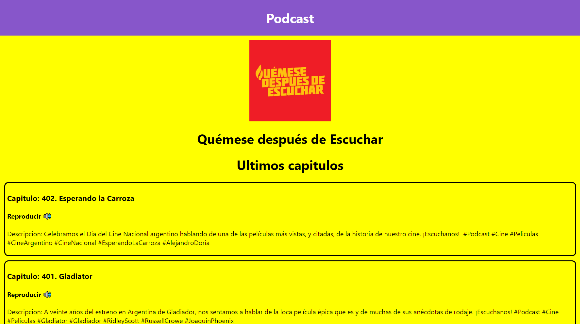

# App de Podcast del Curso de Next JS

App de Podcast integrada con la API de AudioBoom para practicar Next.JS
[Ver la aplicacion](https://podcastapp.now.sh)

# ¿Como funciona?

Require Node.JS 12

- `npm install` para instalar las dependencias
- `npm run dev` para entorno de desarollo
- `npm run build && npm start` para el entorno de produccion

## Licencia

MIT
